# Привет 👋, я Арсен

### C++ разработчик (когда нибудь), студент

- 🔭 Сейчас я работаю над **курсовой про системы лояльности и блокчейн**

- 🌱 Изучаю **React, Tact, TypeScript, SQL (Postgres)**

- ⚡ Из интересного - **у меня чёрный пояс по Айкидо, КМС**

<h3 align="left">Ссылочки:</h3>

<h3 align="left">Языки и инструменты:</h3>

              

